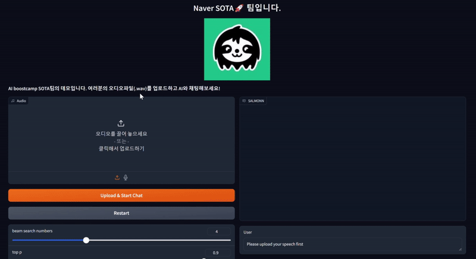
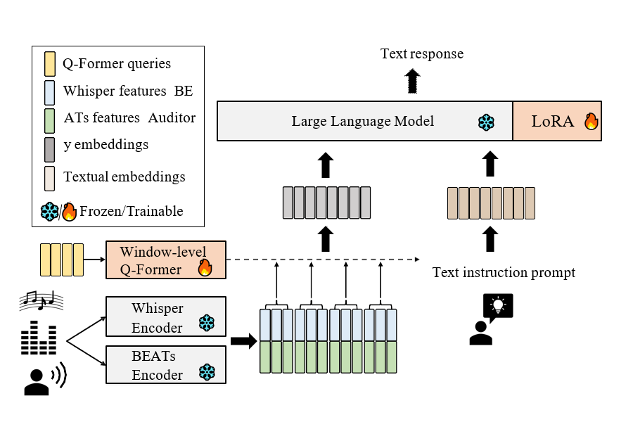
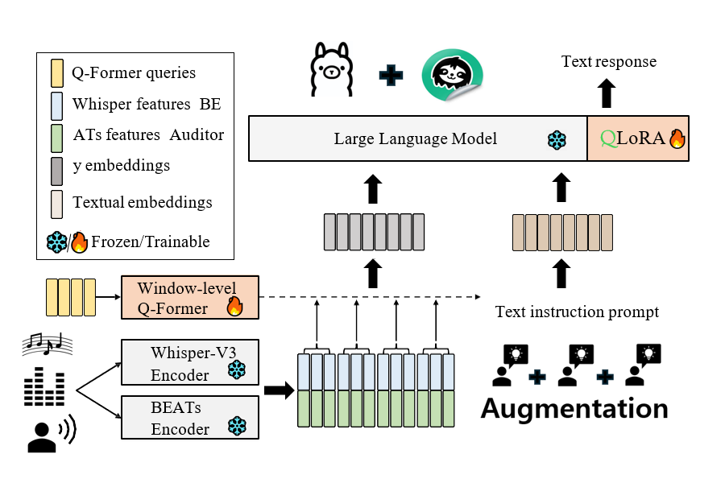

# 안녕하세요, SOTA입니다. 👋
> **SOTA** : State-Of-The-Art 로 최신기술을 의미합니다. AI분야에서 SOTA가 되자는 의미를 담았습니다.

> 최종 발표 [Report](src/Nota_CV_팀리포트(16조).pdf) 및 [발표 자료](src/CV_16조_NOTA_발표자료.pdf)
> 
  

SOTA 프로젝트는 다양한 소리를 듣고 downstream task를 수행할 수 있는 모델의 성능을 어느 정도 유지하면서 최대한 경량화 & 최적화하는 것입니다. 

베이스 모델은 [SALMONN](https://github.com/bytedance/SALMONN)입니다. 

## 팀원 소개
|[김동욱](https://github.com/82153)|[김재진](https://github.com/jeajin)|[이재건](https://github.com/2JAE22)|[박정욱](https://github.com/wjddnr0920)|[황은섭](https://github.com/eunseopski)|
|---|---|---|---|---|
|

|

|

|

|

|
|EDA|개발 환경 구축 및 초기 세팅|개발 환경 구축 및 초기 세팅|EDA|모델 학습 및 실험 관리|
|경량화 기법 및 모델 서칭|BaseLine 코드 및 모델 분석|모델 학습 및 실험 관리|오디오 증강 리서치|BaseLine 코드 및 모델 분석|
|BaseLine 코드 및 모델 분석|Dataset 구축|경량화 기법 및 모델 서칭|BaseLine 코드 및 모델 분석|Dataset 구축|

# demo

# 모델 아키텍처
SALMONN 아키텍처

SOTA 모델 아키텍처

# 결과
|MODEL|SOTA|SALMONN-3B|SALMONN-7B|
|------|---|---|---|
|ASR (WER, %) ↓|5.3|	6.34|5.1|
|AAC (SPIDEr) ↑|35.49|27.84|48.5|
|Memory usage (MB) ↓|4095|9176|15750|

# 환경 세팅 및 추론
`pip install -r requirements.txt`

asr 추론: `python evaluate_salmonn.py --task asr --skip_scoring --cfg-path salmonn_eval_config_asr.yaml`

aac 추론: `python evaluate_salmonn.py --task aac --skip_scoring --cfg-path salmonn_eval_config_aac.yaml`

